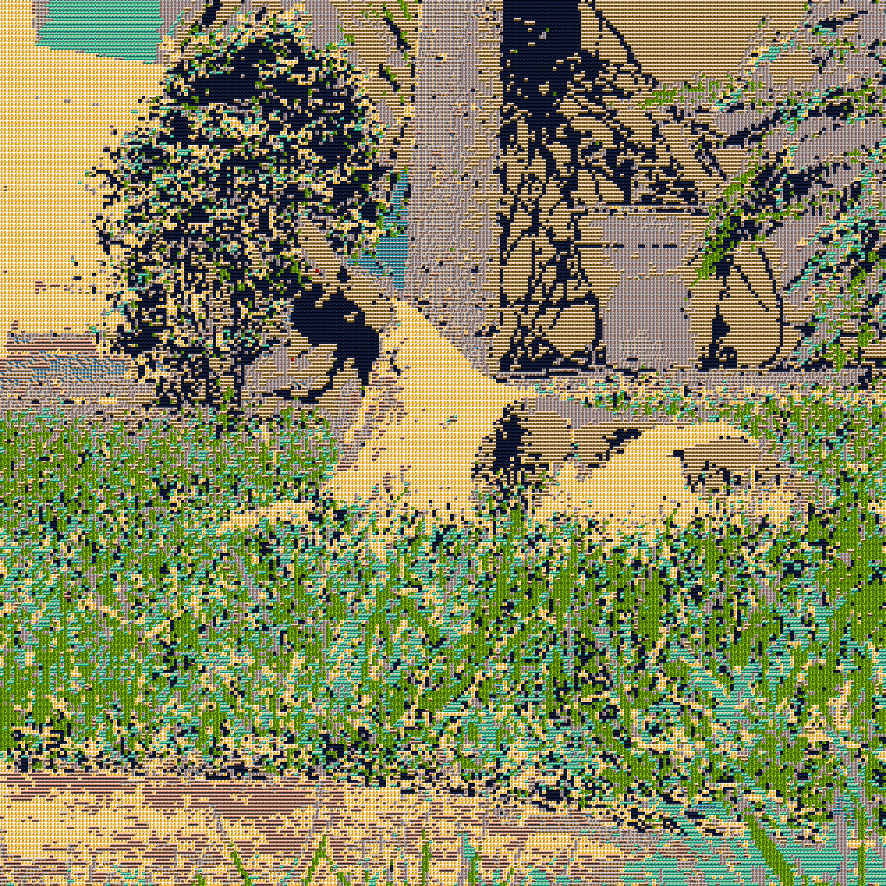

# Troya-Mosaic
Procesamiento de imágenes para generar mosaicos de fotos.

Funcionamiento actual del software:
Foto Original            |  Procesada (14 imágenes)
:-------------------------:|:-------------------------:
  |  
