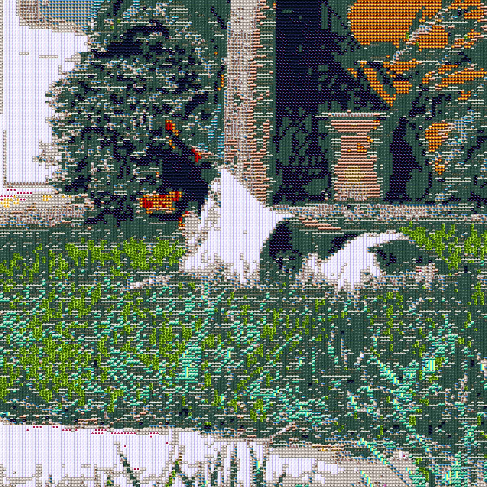
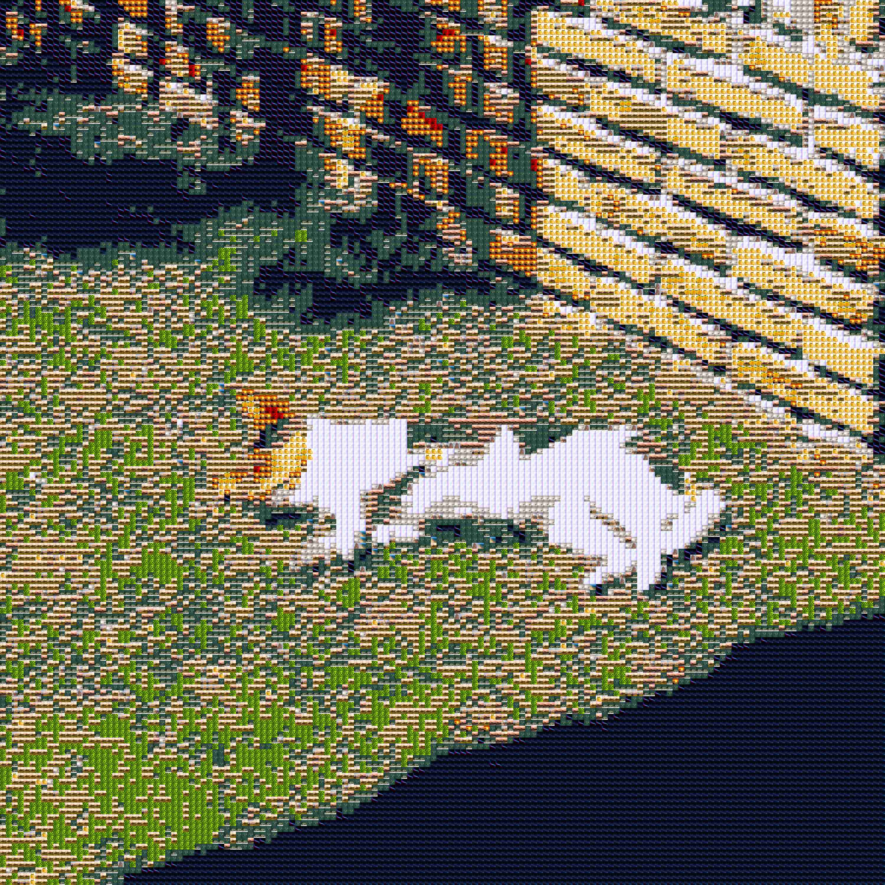

# Troya-Mosaic
Procesamiento de imágenes para generar mosaicos de fotos.

Uso del programa:

`python3 run.py <img_principal> <directorio_mosaicos> <n_imgs_fila> <tamaño_img_result> <nombre_result>`

Funcionamiento actual del software:
Foto Original            |  Procesada (150 imágenes por fila)
:-------------------------:|:-------------------------:
  |   *Click sobre la imagen para poder diferenciar el mosaico*
  |   *Click sobre la imagen para poder diferenciar el mosaico*
  |   *Click sobre la imagen para poder diferenciar el mosaico*

### Funcionamiento
El programa toma todas las imágenes que se vayan a utilizar para el mosaico y se calcula el color más común de cada una de ellas. Tras ello, se divide la imagen principal en el número *azulejos* que se quieran; se irá calculando el color más común en cada uno de esos *azulejos* y se reemplazarán por la imagen que más se acerque en color.

Para calcular el color más común se han desarrollado cuatro métodos distintos:
- *Average*: obtiene el color más común calculando la media de todos los píxeles.
- *PixelCount*: cuenta el número de repeticiones de cada píxel y se queda con el color que más se repita. Puede controlarse la variabilidad de color con el parámetro `redu`.
- *AveragePixelCount*: calcula la media de los *n* colores que más se repitan utilizando *PixelCount*.
- *KMeans*: calcula los colores más comunes utilizando clustering (demasiado lento).

Los mejores resultados, por ahora, se obtienen con *Average*, con bastante diferencia al resto.

Las imágenes de los resultados que se encuentran en este repositorio están bastante comprimidas. El programa puede guardar la imagen con el tamaño deseado.
