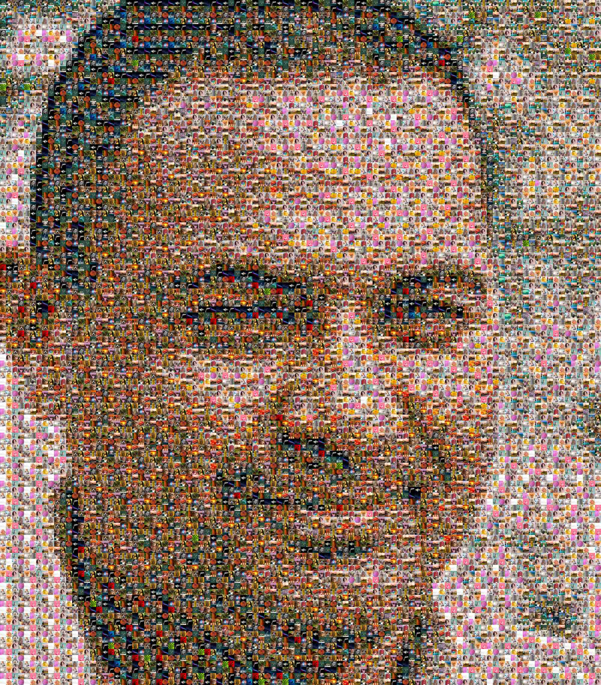

# Troya-Mosaic
Procesamiento de imágenes para crear mosaicos de fotos. Utilizando una serie de imágenes, a las que llamaremos *azulejos*, se generará un mosaico de la imagen deseada. Se permite utilizar imágenes de cualquier tamaño, así como redimensionarlas a la hora de utilizar el software.

Uso del programa:

`python3 run.py <img_principal> <directorio_mosaicos> <n_separacion> <n_imgs_fil> <ancho_result> <nombre_result>`

## Funcionamiento
El programa toma todas las imágenes que se vayan a utilizar para el mosaico y se calcula el color más común de cada una de ellas. Tras ello, se divide la imagen principal en el número *azulejos* que se quieran insertar; se irá calculando el color más común en cada uno de esos *azulejos* y se reemplazarán por la imagen que más se acerque en color.

Para calcular el color más común se han desarrollado cuatro métodos distintos:
- *Average*: obtiene el color más común calculando la media de todos los píxeles.
- *PixelCount*: cuenta el número de repeticiones de cada píxel y se queda con el color que más se repita. Puede controlarse la variabilidad de color con el parámetro `redu`.
- *AveragePixelCount*: calcula la media de los *n* colores que más se repitan utilizando *PixelCount*.
- *KMeans*: calcula los colores más comunes utilizando clustering (demasiado lento).

También se ha implementado un método que compara las imágenes píxel a píxel, pero es bastante ineficiente.

Tras generar el resultado, se permite superponer la imagen principal sobre la generada para colorear los azulejos y poder diferenciar mejor la imagen resultante.

Las imágenes generadas que se encuentran en este repositorio están bastante comprimidas. El programa puede guardar la imagen con el tamaño deseado.

**Nota:** finalmente, se ha tomado la decisión de utilizar siempre el método de la media.

## Ejemplos

A continuación se muestran ejemplos de los mosaicos que se pueden generar con el programa. Para crearlos, se han utilizado 64 fotos escogidas aleatoriamente de internet y se han generado mosaicos con 100 imágenes por fila.

(*Haga click sobre las imágenes para poder diferenciar los mosaico*)

Dist. Repetición            | artificial_man.jpg  | flores.png | troyita_buenasnoches.png
:-------------------------:|:-------------------------:|:-------------------------:|:-------------------------:
Original |   |    |  
0 |   |   | 
1 |   |   | 
2 |   |   | 
3 |   |   | 

Como podemos ver, conforme aumenta la distancia para que no se repitan los azulejos la imagen se va viendo algo peor. Para solucionar esto, podemos superponer la imagen principal sobre la generada con la transparencia deseada, según el parámetro `alpha`.

`n_separacion=3 alpha=0`           | `n_separacion=3 alpha=0.3`
:-------------------------:|:-------------------------:
 |  
